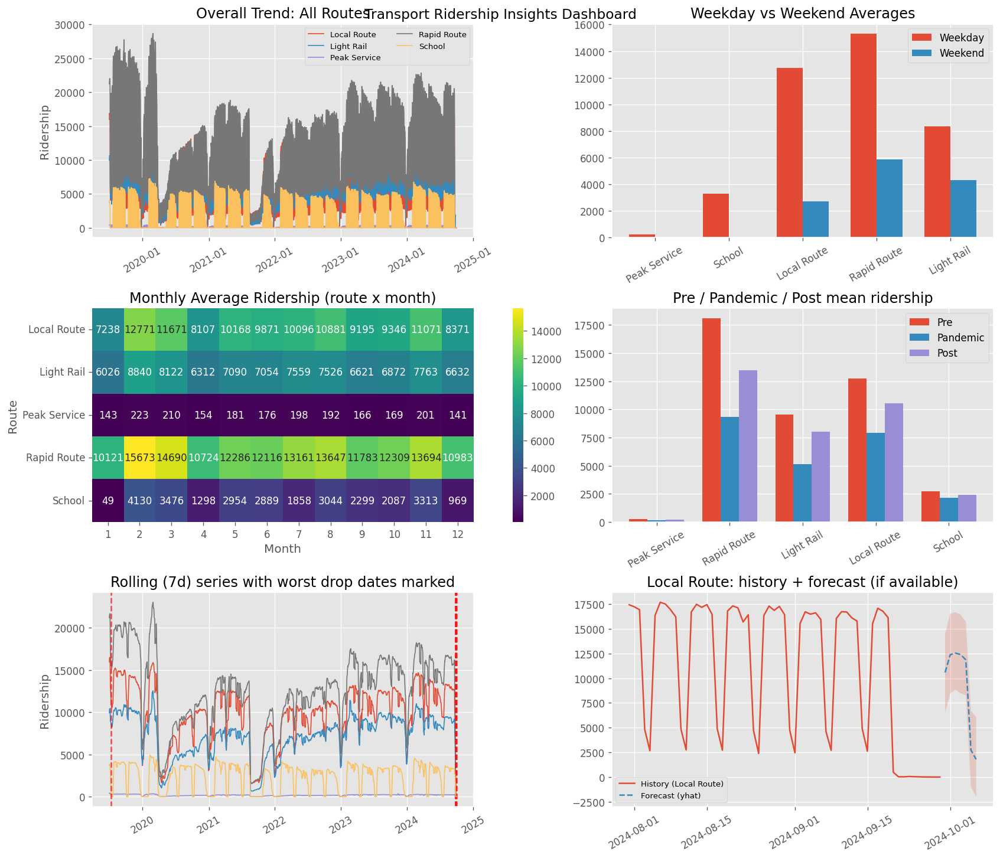

# Insight Report — Transport Ridership Forecasting

This report contains programmatic insights and visualizations generated from the dataset.

## 1. Dashboard Overview

## 2. Weekday vs Weekend summary
See the chart in the dashboard. Detailed CSV: `../results/insights/weekday_vs_weekend_summary.csv`

## 3. Monthly seasonality (heatmap)
See the dashboard heatmap. CSV: `../results/insights/monthly_avg_by_route.csv`

## 4. Pandemic impact
Pre / Pandemic / Post means and changes saved at:
`../results/insights/pandemic_impact_summary.csv`

## 5. Largest drops / Anomalies
Top detected drops saved at:
`../results/insights/largest_drops_summary.csv`

## 6. Quick recommendations (auto-generated)
- Use weekday-vs-weekend demand to size service frequency on weekdays.  
- Investigate the largest drop dates for operational causes (strikes, weather, lockdowns).  
- Add holiday calendars to the forecasting model to improve accuracy.  
- Consider focused monitoring for School route during term transitions.
